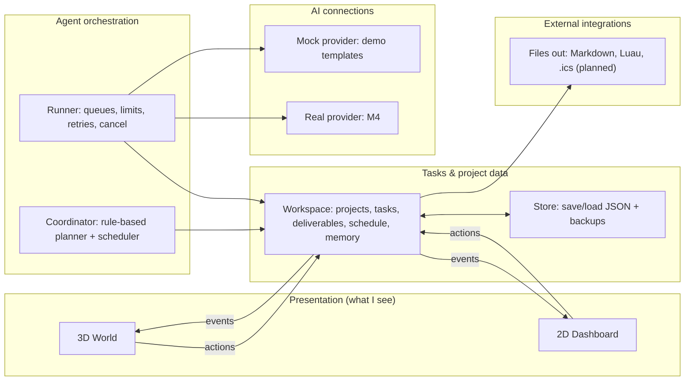

# Architecture

Five layers that stay separate, so any one can change without breaking the others.



## The rules that keep it clean
1. **The 3D world and the dashboard never own data.** They send *actions* ("approve plan", "mark done") and redraw when the workspace sends an *event* ("task changed"). This way the world can't disagree with the board.
2. **Agent states are calculated from tasks.** An agent is "working" only if one of its tasks has status `working`. There's no separate fake state to fall out of sync.
3. **The Runner is the only thing that calls AI.** It enforces the limits (time, retries, cost, delegation), and it's where Cancel works.
4. **Providers all look the same.** The mock and the real AI share one interface: `start(job)`, which later finishes with text, usage, and cost. Switching between them changes no other code.
5. **Integrations only write files or run after approval.** Nothing reaches an online account in the MVP.

## One task, start to finish
1. I submit a goal. The **Coordinator** matches keywords to areas, picks task templates, and builds a *Plan* (status `proposed`).
2. I approve it. Its tasks become `queued`, and the **Scheduler** places them into free time blocks.
3. The **Runner** checks every quarter second: is there a queued task whose dependencies are ready and whose owner is free? If so, it sets the task to `working` and starts a job with the agent's provider.
4. The job finishes. The Runner creates a *Deliverable*, sets the task to `review`, and logs the activity and usage.
5. Every change sends an event. The world animates it, the dashboard updates, and the Store autosaves (at most every few seconds).

## Context sharing (keeps areas separate)
An agent working on a task sees only:
- the task itself and its project's short description,
- the deliverables of the tasks it **depends on** (this is how a Roblox concept reaches the TikTok scripts),
- its own memory notes for **this project**.

School, business, and creator projects never see each other unless a dependency links them or I share a project on purpose.

## Folder layout (built in M1)
```
ecosystem/
  project.godot, main.tscn, app.gd   # app entry + global "App" singleton
  core/            # data: task.gd, workspace.gd, store.gd, schedule.gd (no 3D, no UI)
  orchestration/   # coordinator.gd, scheduler.gd, runner.gd, templates/
  ai/              # provider.gd, mock_provider.gd, (M4) real provider
  integrations/    # file exporters (planned)
  ui/              # 2D dashboard
  world/           # 3D world
  assets/models/   # Astra .glb files go here
  tests/           # headless tests
  tools/           # app_driver.gd: end-to-end runs and screenshots
  vault/           # this Obsidian vault (ignored by Godot)
```
See [[Data Model]].
